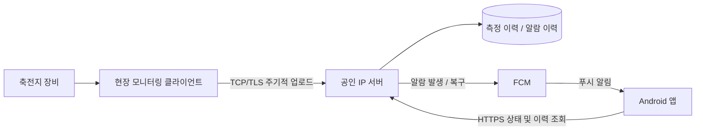

# BatteryWatch

**새 PC/Ubuntu에 checkout한 뒤에는 [환경 재현 안내](docs/reproduce.md)를 먼저 따르세요.** `bootstrap.py`와 잠금 파일로 서버·수집기의 독립 환경을 만들고, Android는 포함된 Gradle Wrapper로 빌드합니다. 토큰·인증서·현장 데이터는 별도 복원합니다.

세 프로그램의 설계·데이터 흐름·인증서/토큰 생성·운영 설정은 [통합 개발·운영 상세서](docs/developer-guide.md)에서 확인하세요. 고객사 전달용 [Word 문서](docs/BatteryWatch_통합_개발운영_상세서.docx)도 함께 제공합니다.

축전지 데이터를 공인 IP 서버에 축적하고 Android 앱에서 상태 및 안전 알람을 확인하는 신규 프로젝트입니다. 기존 RMS_Server와 독립적으로 개발합니다.

## 현재 상태

TBC1000B V3.2.6 기반 수집 클라이언트에 TCP 업로드(기본 5초), 설정 UI, 영속 큐와 재접속을 구현했습니다. [클라이언트 실행 안내](monitoring-client/README.md). 서버의 TCP/TLS 인증·SQLite 저장·중복 방지·ACK·백업, 조회 API, 알람 판정·복구·확인 기록, FCM 발송 큐와 Android 화면도 구현했습니다. 운영 수치 임계값은 기본 비활성이며, 실제 푸시 사용에는 Firebase 설정이 필요합니다. [서버 안내](server/README.md), [알람·푸시 설정](docs/alarms-and-push.md), [Android 빌드](android-app/README.md).

## 구성

```text
BatteryWatch/
├── android-app/        # Android 사용자 앱
├── server/             # 수집 API, DB, 조회 API, 알람 판정 및 푸시
├── monitoring-client/  # 현장 장비 데이터 수집 및 주기적 서버 업로드
└── docs/               # 공통 설계와 데이터 예시
```



## 핵심 요구사항

- 현장별/장비별/모듈별 SOC, 셀 온도, 셀 전압 등 측정값을 계속 저장합니다.
- 앱에서 서버 주소를 설정하고 최신 상태 및 알람 이력을 확인합니다.
- 화면을 닫은 상태에서도 서버가 안전 알람을 판정하고 푸시를 전송합니다.
- 측정 중단, 장비 통신 실패, 업로드 지연을 정상 상태와 구분합니다.
- 업로드 재시도 시 같은 데이터와 알람이 중복 생성되지 않도록 합니다.
- 측정 임계값은 장비 사양과 운영 정책을 확인한 후 설정합니다.

## 확정이 필요한 사항

- 현장 수집 방식: TBC1000B V3.2.6의 SNMP 수집/Trap 수신 사용 (확정)
- 서버 운영체제 및 현장 클라이언트 운영체제
- 현장·장비·사용자 수, 수집/업로드 주기, 이력 보존 기간
- SOC·온도·전압 임계값, 지속시간, 복구 조건, 반복 알림 정책
- Firebase 프로젝트와 Android 패키지 이름, 사용자 인증 방식

Android 백그라운드 동작과 구현 순서는 [docs/architecture.md](docs/architecture.md)를 참고합니다.
