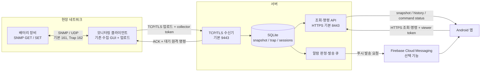
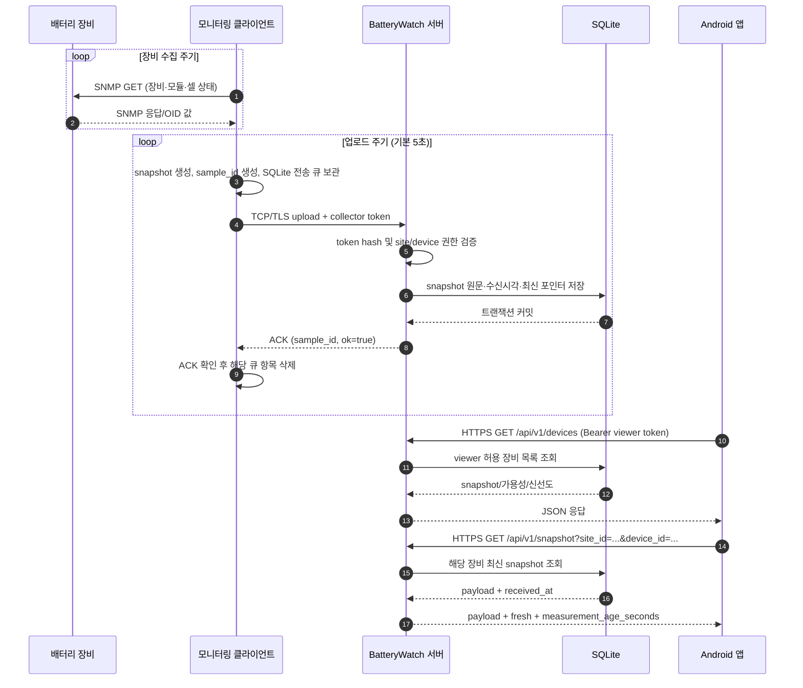
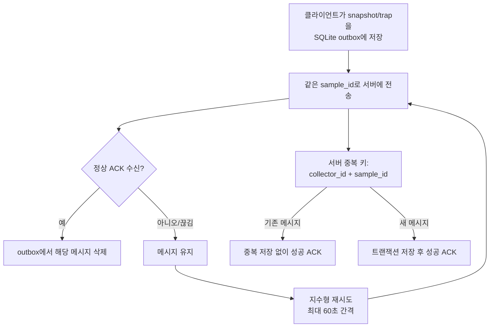
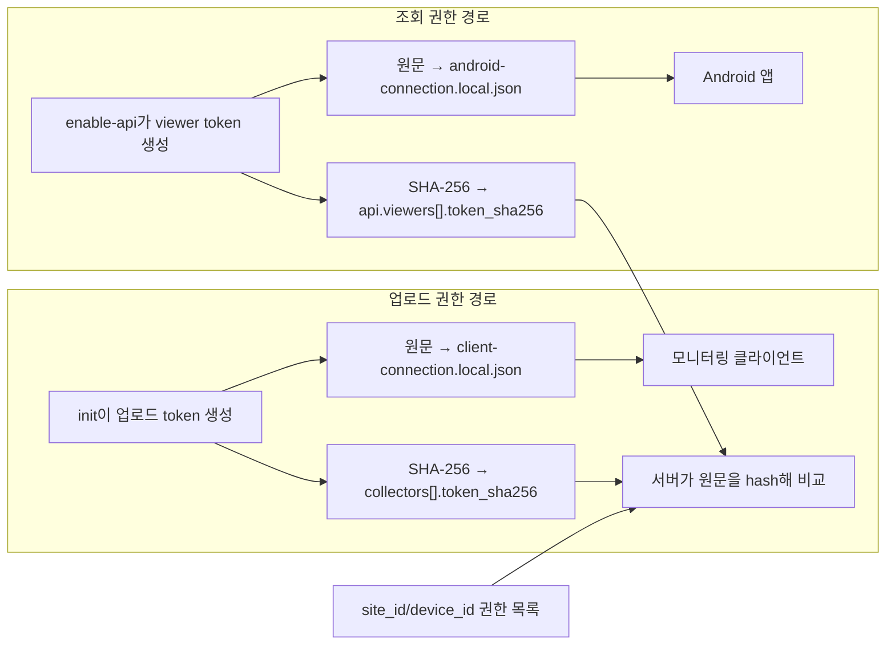
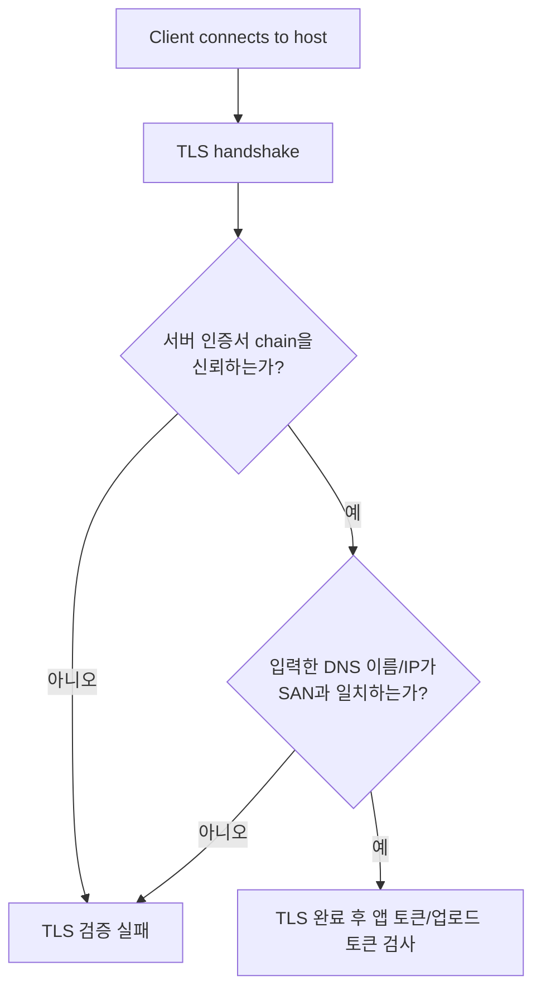
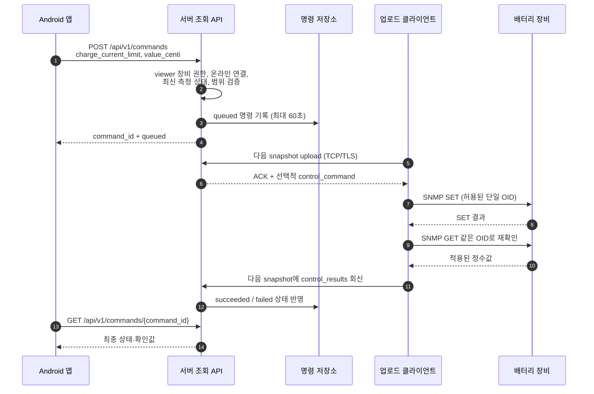
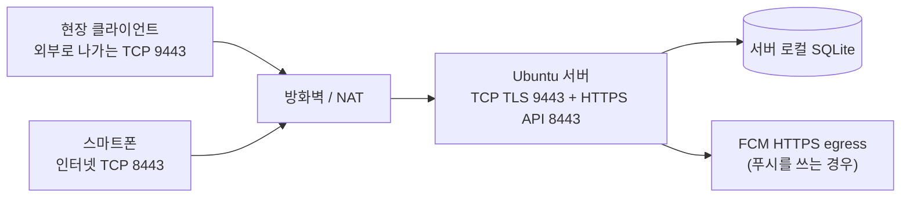
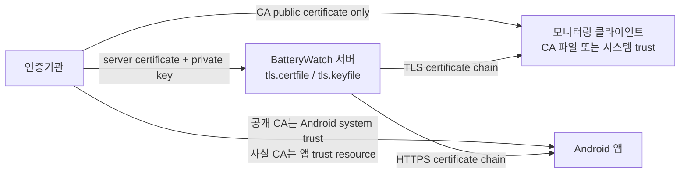
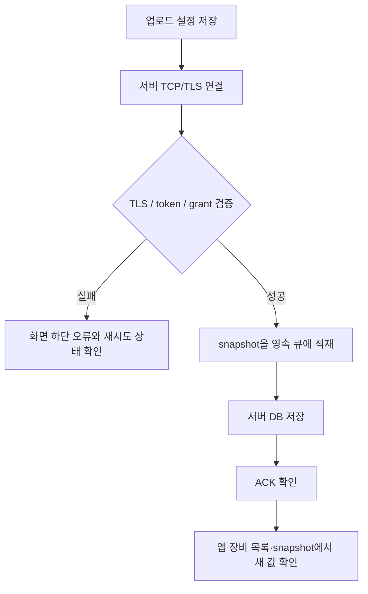

# BatteryWatch 통합 개발·운영 상세서

> 대상: 서버 운영자, 모니터링 클라이언트 설치자, Android 앱 사용자
> 기준: 현재 저장소 구현. 실제 장비의 SNMP OID·상태 코드와 운영 인증서/주소는 현장 설정을 기준으로 확인하세요.
> 보안: 예시 토큰, 비밀번호, 개인키는 실제 자격증명이 아닙니다. 로컬 `*.local.json`, 프로필, 개인키, 측정 DB는 Git에 올리지 마세요.

## 목차

1. [시스템 한눈에 보기](#1-시스템-한눈에-보기)
2. [세 프로그램의 역할과 책임](#2-세-프로그램의-역할과-책임)
3. [전체 데이터 흐름과 통신](#3-전체-데이터-흐름과-통신)
4. [식별자·토큰·인증서의 관계](#4-식별자토큰인증서의-관계)
5. [데이터 구조와 통신 상태 해석](#5-데이터-구조와-통신-상태-해석)
6. [원격 충전전류제한 처리 흐름](#6-원격-충전전류제한-처리-흐름)
7. [포트·방화벽·배포 배치](#7-포트방화벽배포-배치)
8. [새 서버의 설정·토큰 생성](#8-새-서버의-설정토큰-생성)
9. [TLS 인증서 발급·적용·확인](#9-tls-인증서-발급적용확인)
10. [모니터링 클라이언트 설정 및 업로드](#10-모니터링-클라이언트-설정-및-업로드)
11. [Android 앱 설치와 연결 설정](#11-android-앱-설치와-연결-설정)
12. [운영 확인·문제 해결·백업](#12-운영-확인문제-해결백업)
13. [보안·변경·재배포 체크리스트](#13-보안변경재배포-체크리스트)
14. [관련 구현 문서](#14-관련-구현-문서)

---

## 1. 시스템 한눈에 보기

BatteryWatch는 세 프로그램이 역할을 나누는 원격 모니터링 시스템입니다.



**운영의 기본 원칙:** 현장 클라이언트가 측정 데이터의 생산자이고, 서버가 저장·권한·최신성·알람·원격 명령의 중계자이며, 앱은 서버에 등록된 장비를 조회하고 제한된 원격 설정을 요청하는 소비자입니다. 앱은 배터리 장비에 직접 접속하지 않습니다.

## 2. 세 프로그램의 역할과 책임

| 프로그램 | 실행 위치 | 주된 책임 | 네트워크 연결 |
|---|---|---|---|
| 모니터링 클라이언트 | 장비와 통신 가능한 현장 PC | SNMP 수집, 화면 표시, snapshot/Trap 업로드, 허용된 원격 명령 실행 | 장비와 SNMP/UDP, 서버와 TCP/TLS |
| BatteryWatch 서버 | Linux/Ubuntu 등 항상 실행되는 서버 | 수집 인증, DB 저장, 중복 제거, 최신 snapshot·이력 API, 알람/명령 큐, 통신중단 판정 | 클라이언트 수신 TCP/TLS, 앱 조회 HTTPS |
| Android 앱 | 사용자 스마트폰 | 권한이 있는 현장·장비 선택, 최신값·상태·이력·알람 표시, 충전전류제한 변경 요청 | 서버 조회 HTTPS만 사용 |

프로그램별 진입점과 책임의 상세 구현:

- 서버 실행 진입점: `server/server.py`; 수신기: `server/receiver.py`; 조회 API: `server/mobile_api.py`; 저장소: `server/storage.py`.
- 클라이언트 실행 파일: `monitoring-client/monitor.py`; 전송 큐/ACK/TLS: `monitoring-client/upload_transport.py`; 업로드 UI와 snapshot 작성: `monitoring-client/upload_ui.py`; 제한된 SNMP 원격 설정: `monitoring-client/remote_control.py`.
- 앱 설정 화면: `android-app/app/src/main/java/com/batterywatch/monitor/ConnectionSettingsDialog.java`; HTTPS API: `ApiClient.java`; 현장·장비·랙 상세 화면: `BatteryDashboard.java`.

앱 조회 토큰과 업로드 토큰은 하나로 합치지 않습니다. 사용 편의를 위해서는 **모든 클라이언트가 같은 업로드 토큰 하나를 공유하고, 앱도 조회 토큰 하나를 공유**하도록 구성할 수 있지만, 서로 다른 역할이므로 실제 토큰 원문은 두 개입니다.

## 3. 전체 데이터 흐름과 통신

### 3.1 정상 측정값 업로드와 조회



### 3.2 재시도와 중복 제거



서버는 DB 커밋 전에 성공 ACK를 보내지 않습니다. 재전송된 과거 메시지는 이력에 저장될 수 있지만, 더 최신 `captured_at`의 장비 상태를 덮어쓰지 않습니다. 실제 측정 최신성 판단에는 클라이언트 생성시각만이 아니라 `last_poll_at`, `connected`, `last_poll_ok`를 함께 씁니다.

### 3.3 앱의 최신성 표기

서버는 snapshot에서 `data.last_poll_at`을 기준으로 측정 나이를 계산합니다. 현재 구현에서 측정시각이 현재보다 미래가 아니고 **60초 이내**, `connected=true`, `last_poll_ok=true`인 경우에만 `fresh=true`입니다. 이는 UI/API의 신선도 규칙이지, 장비 안전성을 보증하는 판정은 아닙니다.

조회 주요 경로:

| API 경로 | 용도 |
|---|---|
| `GET /api/v1/devices` | viewer token이 허용한 현장·장비 목록 및 가용성 |
| `GET /api/v1/snapshot?site_id=…&device_id=…` | 최신 snapshot과 신선도 |
| `GET /api/v1/history?...` | 최근 snapshot/Trap 기록 |
| `GET /api/v1/alarms?...` | 활성 알람과 발생·복구 이력 |
| `POST /api/v1/acknowledgements` | 알람 확인 기록 |
| `POST /api/v1/commands` | 제한된 충전전류제한 명령 요청 |
| `GET /api/v1/commands/{command_id}` | 명령 완료·실패·시간초과 상태 조회 |

## 4. 식별자·토큰·인증서의 관계

### 4.1 자격증명 구분표

| 항목 | 보관 위치/생성 방법 | 사용하는 곳 | 형식·목적 |
|---|---|---|---|
| 업로드 token 원문 | 서버의 `client-connection.local.json`; 최초 `init`이 생성 | 현장 클라이언트 업로드 설정 | 비밀 문자열. `collectors[].token_sha256`과 검증 |
| 업로드 token 해시 | 서버 실제 `server.local.json` | 서버만 | SHA-256 64자리 hex. 클라이언트에는 입력하지 않음 |
| 앱 조회 token 원문 | 서버의 `android-connection.local.json`; 최초 `enable-api`가 생성 | Android 앱 연결 화면 | 별도 비밀 문자열. 앱의 Bearer 인증 |
| 조회 token 해시 | `server.local.json`의 `api.viewers[].token_sha256` | 서버만 | 업로드 토큰과 반드시 다른 hash |
| 서버 개인키 | 인증서 발급 시 생성, 서버의 제한된 파일 위치 | 서버 TCP TLS 및 API TLS | 절대로 앱/클라이언트/GitHub에 복사하지 않음 |
| 서버 인증서 | CA가 발급, 서버 `tls.certfile`로 설정 | 서버가 연결 상대에 제시 | 접속 호스트/IP가 SAN과 일치해야 함 |
| CA 공개 인증서 | CA 제공/내부 PKI에서 export | 클라이언트 CA 파일, 앱 신뢰 저장소 | 공개 인증서만 배포; CA 개인키는 별도 보관 |
| 현장 ID / 장비 ID | 운영자가 정함; server collector grant와 일치시킴 | 클라이언트 업로드 및 앱 선택 | 이름 표시용 텍스트와 구별되는 권한 식별자 |
| collector ID / viewer ID | 서버 설정 생성 시 부여 | 서버 권한·DB 연결 | 각각 업로드 주체와 앱 조회 주체 |



**토큰의 원문을 해시에서 되살릴 수 없습니다.** 원문이 유실되면 새 토큰을 안전하게 생성해 서버 해시와 해당 클라이언트/앱을 일치시키고, 이전 토큰을 폐기해야 합니다. 한 토큰을 여러 장비에 쓰려면 그 토큰이 속한 한 collector/viewer의 `devices` 허용 목록에 각 장비의 **현장·장비 쌍**을 등록합니다.

### 4.2 인증서의 두 독립 검사

TLS 연결은 암호화만으로 충분하지 않습니다. 접속한 서버가 신뢰한 인증기관에서 인증서를 발급받았는지와 접속 주소가 인증서의 SAN(Subject Alternative Name)에 포함되는지를 확인합니다.



- IP가 바뀌어도 앱·클라이언트가 SAN에 포함된 **같은 도메인**으로 접속하고 DNS만 변경한다면 인증서 재발급이 보통 필요하지 않습니다.
- 새 도메인이나 새 IP로 직접 접속하고 그 값이 SAN에 없다면 새 인증서를 발급해야 합니다.
- 포트 변경만으로 SAN은 달라지지 않으므로 인증서 재발급 사유가 아닙니다.
- TLS 인증서 갱신은 토큰 권한을 변경하지 않습니다. 토큰 교체도 인증서의 SAN을 바꾸지 않습니다.

**현재 앱의 신뢰 설정 주의:** 앱은 HTTPS만 허용하고 Android 네트워크 보안 설정에서 시스템 CA를 신뢰합니다. 추가로 현재 서비스 IP `61.105.141.21`에 대해 앱에 포함된 BatteryWatch 사설 CA anchor가 구성되어 있습니다. 다른 서비스 IP에서 동일한 사설 CA를 사용하려면 앱 리소스의 도메인 trust 설정도 새 주소에 맞춰 앱을 다시 빌드해야 합니다. 공인 신뢰 CA를 사용하는 DNS 도메인으로 전환하는 경우 시스템 신뢰 체인으로 검증할 수 있습니다. 새 주소에서는 앱·클라이언트 모두 실제 TLS 연결을 별도 시험하세요.

## 5. 데이터 구조와 통신 상태 해석

### 5.1 Snapshot 봉투와 값 단위

```json
{
  "schema_version": 1,
  "sample_id": "생성된 UUID",
  "captured_at": "UTC ISO-8601 snapshot 생성시각",
  "site_id": "서버에 등록된 현장 ID",
  "device_id": "서버에 등록된 장비 ID",
  "kind": "snapshot",
  "data": {
    "connected": true,
    "last_poll_ok": true,
    "last_poll_at": "UTC ISO-8601 마지막 성공 측정시각",
    "module_map": {},
    "module_data": {},
    "operating_status": {},
    "control_results": []
  }
}
```

대표 단위:

| 필드 | 단위/의미 |
|---|---|
| `module_data[*].volt` | V |
| `module_data[*].current` | A |
| `module_data[*].cells[]` | 셀 전압 V |
| `module_data[*].temps[]` | 셀 온도 °C |
| `module_data[*].soc`, `soh` | % |
| `module_data[*].status` | 장비가 보고한 모듈 상태 코드 |
| `module_data[*].communication_status` | 앱 표시용 상태명 |
| `operating_status.discharge_count` | 누적 방전 횟수 |
| `operating_status.charge_current_limit_c` | 충전전류 제한 C |
| `operating_status.charge_cutoff.*` | 충전차단/차단기 상태. `null`은 상태 미확인이지 정상 아님 |
| `operating_status.soc_charge_limit` | 장비가 지원할 때 지원·활성·설정값 |
| `control_results[]` | SNMP 설정 후 클라이언트가 회신한 명령 결과 |

클라이언트가 업로드하는 `communication_status` 표시 규칙:

| 코드 | 상태명 | 해석 |
|---:|---|---|
| 0 | Online | 모듈 online |
| 1 | Offline | 모듈 offline |
| 2 | Sleep | 절전 |
| 3 | Disconnect | 모듈 연결 끊김 |
| 4 | 충전중 | 장비 상태가 충전 중 |
| 5 | 방전중 | 장비 상태가 방전 중 |
| 6 | Standby | 대기 |
| 255 | Unknown | 장비가 미상 코드 보고 |

별개의 계층 상태인 **클라이언트↔서버 업로드 연결**과 **클라이언트↔장비 SNMP 통신**도 함께 봐야 합니다. 앱의 모듈 상세는 장비가 보고한 모듈 상태를, 장비/현장 카드의 fresh/오래된 표시는 업로드·측정 시각을 나타냅니다. `Unknown`/`—`을 정상으로 간주하지 마세요. `raw_oids`, `last_poll_ok`, `last_poll_error`, `snmp_fail_count`를 함께 확인합니다.

### 5.2 현장 이름과 ID는 다름

`site_id/device_id`는 토큰 권한에 사용되는 정확한 식별자입니다. 클라이언트 GUI의 설치 장소/축전지명은 사람이 읽는 화면 표시 값이며 ID와 자동으로 같아지지 않습니다. 오탈자, 대소문자 차이, grant의 서로 다른 현장·장비 조합은 거부됩니다.

## 6. 원격 충전전류제한 처리 흐름



제약:

- 앱은 **0.05~1.00 C**만 요청할 수 있습니다. 서버와 클라이언트가 각각 재검증합니다.
- 요청값은 0.01 C 단위로 centi 값으로 전달됩니다(예: 0.50 C → `value_centi: 50`).
- 장비 SNMP IP·GET/SET community는 현장 클라이언트 안에서만 사용하며 서버 명령/API나 앱에 보내지 않습니다.
- 클라이언트는 정해진 충전전류제한 SNMP OID만 SET하고, GET 값이 요청과 정확히 일치할 때 성공으로 보고합니다.
- 서버는 새롭고 online인 장비에만 명령을 접수하며 명령은 60초 후 만료됩니다. 업로드 중이 아닌 클라이언트는 명령을 당겨갈 수 없습니다.
- SET 이후 GET 실패/불일치는 성공으로 처리되지 않습니다. 실제 장비 호환성, 안전한 설정 범위는 제조사 문서와 현장 시험으로 검증해야 합니다.
- 이것은 장비 보호회로를 대체하거나 실시간 안전 제어를 보장하지 않습니다.

## 7. 포트·방화벽·배포 배치

### 7.1 기본 포트

| 포트 | 방향 | 연결 | 기본 설정 |
|---:|---|---|---|
| UDP 161 | 현장 클라이언트 → 장비 | SNMP GET/SET | 장비/프로필에서 설정 |
| UDP 162 | 장비 → 현장 클라이언트 | SNMP Trap | 클라이언트 수신 포트; 방화벽 허용 필요 |
| TCP 9443 | 현장 클라이언트 → 서버 | 업로드 TCP/TLS | 서버 최상위 `host`, `port` |
| TCP 8443 | Android 앱 → 서버 | 조회/명령 API HTTPS | `api.host`, `api.port` |
| TCP 443/80 | 발급기관/인터넷 ↔ 서버 | 인증서 발급·갱신 challenge | 선택한 CA/발급 방식에 따라 필요 |

9443은 앱 조회 포트가 아닙니다. 8443은 업로드 포트가 아닙니다. 공유기/NAT에서 외부 포트를 다르게 매핑했다면 각 클라이언트가 사용하는 **외부 접속 포트**를 정확히 입력해야 합니다.

### 7.2 직접 노출 배치 예시



공인/사설망 인터페이스에 직접 바인딩할 때 TCP 수신기와 조회 API 모두 TLS를 설정해야 합니다. 앱이 인터넷에서 접속하려면 API bind 주소·방화벽·도메인/DNS·인증서가 모두 맞아야 합니다. 서버는 같은 DB에 여러 프로세스를 동시에 띄우는 HA 구성이 아닙니다. 동일 DB로 BatteryWatch 서버 프로세스 두 개를 실행하지 마세요.

## 8. 새 서버의 설정·토큰 생성

다음은 새 서버의 최초 구성 예입니다. 기존 운영서버에서는 `init` 또는 `enable-api`를 반복 실행하지 마세요. 기존 설정/토큰/DB를 백업하고 보존한 뒤 수정합니다.

### 8.1 환경과 초기 collector 생성

```bash
cd /home/<계정>/work/BatteryWatch
python3.12 bootstrap.py server --test
cd server
.venv/bin/python server.py init \
  --grant site-01/battery-01 \
  --grant site-02/battery-02
```

`init`은 서버 설정과 업로드 자격증명을 한 번 생성합니다.

- `server/server.local.json`: collector 설정, 업로드 토큰 해시, 장비 허용 목록, DB와 포트.
- `server/client-connection.local.json`: 클라이언트에 전달할 **업로드 토큰 원문**, 기본 접속값.
- 각 파일은 `init`을 실행한 서버 디렉터리에 생성됩니다. 기존 파일이 있으면 덮어쓰지 않습니다.
- 둘 다 비밀/로컬 파일이며 안전한 전달과 백업 대상입니다. `client-connection.local.json`을 GitHub, 이메일 공개 링크, 채팅방에 올리지 마세요.

collector의 `devices` grant를 필요 장비 전체로 구성하면 여러 현장 클라이언트가 동일 collector 업로드 토큰을 공유할 수 있습니다. 각각의 클라이언트 프로필에는 같은 토큰을 넣고, 각자 올바른 `site_id/device_id` 쌍을 지정합니다. 기존 운영 서버에서 장비를 추가할 때는 그 서버의 `server.local.json`의 올바른 collector/viewer grant만 편집하고 변경 백업·검증 후 서버를 재시작합니다.

### 8.2 앱 viewer token 생성

첫 구성에서 앱이 볼 장비가 전부 collector grant에 등록된 다음 실행합니다.

```bash
.venv/bin/python server.py enable-api
```

특정 grant만 노출하려면 처음 활성화할 때 다음처럼 반복 지정합니다.

```bash
.venv/bin/python server.py enable-api \
  --grant site-01/battery-01 \
  --grant site-02/battery-02
```

결과:

- `server.local.json`에 별도의 `api.viewers[]` hash와 권한 grant가 기록됩니다.
- `server/android-connection.local.json`에 **앱 조회 토큰 원문**과 기본 `server_url`이 생성됩니다.
- 새 파일이 이미 있거나 API가 이미 설정되어 있으면 명령은 기존 권한/토큰을 덮어쓰지 않고 종료합니다.
- viewer는 collector에 등록된 현장·장비만 허용할 수 있습니다.
- 기존 API의 권한 목록을 바꾸려면 해당 viewer의 `devices` 목록을 조정합니다. 같은 토큰을 유지할 수 있지만 새 grant가 collector에도 허용되어 있어야 합니다.

`enable-api` 생성 당시 기본 API bind/URL은 루프백 주소일 수 있습니다. 외부 운영에서는 실제 주소를 넣기 전에 아래 배포값을 맞추세요.

### 8.3 운영 설정과 검증

서버 설정 예(필수 항목만):

```json
{
  "host": "0.0.0.0",
  "port": 9443,
  "database": "data/batterywatch.sqlite3",
  "tls": {
    "certfile": "/etc/letsencrypt/live/telemetry.example.com/fullchain.pem",
    "keyfile": "/etc/letsencrypt/live/telemetry.example.com/privkey.pem"
  },
  "api": {
    "enabled": true,
    "host": "0.0.0.0",
    "port": 8443,
    "viewers": [
      {
        "id": "android-01",
        "token_sha256": "<enable-api가 생성한 해시를 유지>",
        "devices": [
          {"site_id": "site-01", "device_id": "battery-01"},
          {"site_id": "site-02", "device_id": "battery-02"}
        ]
      }
    ]
  }
}
```

이 예시는 운영 파일 전체가 아닙니다. 기존 collector, hashes, push/alarms/retention 값을 유지하세요. private key를 설정 JSON이나 Git에 넣지 않고 로컬 파일 경로만 가리킵니다. 키 파일은 BatteryWatch 서버 프로세스 실행 계정만 읽을 수 있도록 OS 권한을 제한합니다.

```bash
.venv/bin/python server.py --config server.local.json check
.venv/bin/python server.py --config server.local.json doctor
```

`check`는 구성 구문/필수값을 검증합니다. `doctor`는 인증서·API 등 배포 조건을 점검하되 자격증명을 출력하지 않습니다. 설정 변경 적용에는 운영 프로세스의 정상 재시작이 필요합니다.

### 8.4 수동 토큰을 새로 만들어야 하는 경우

가능하면 `init`/`enable-api`가 생성한 원문과 해시를 짝으로 사용하세요. 기존 서비스의 토큰을 직접 회전할 때는 운영 설정에서 맞는 **한 역할**의 token hash를 새 SHA-256으로 바꾸고, 클라이언트/앱 원문도 동시에 안전하게 갱신한 뒤 구 토큰을 폐기합니다.

예시 생성은 명령 출력이 비밀이므로 서버 셸에서 직접 실행하고, 로그 기록/공유 화면/스크립트 history에 노출되지 않게 취급합니다.

```bash
python3.12 -c 'import secrets,hashlib; t=secrets.token_urlsafe(32); print(t); print(hashlib.sha256(t.encode()).hexdigest())'
```

출력 첫 줄은 클라이언트 또는 앱에 넣을 원문이고 두 번째 줄은 서버 JSON에 저장할 해시입니다. 혼동 방지를 위해 어느 값이 업로드/조회 용도인지 안전한 암호관리 절차로 기록하세요. 앱용 viewer token을 `collectors`에 넣거나 collector token을 앱에 입력하면 안 됩니다.

## 9. TLS 인증서 발급·적용·확인

### 9.1 권장: 고정 도메인 + 공개 CA

고정 도메인(예: `telemetry.example.com`)을 정하고 DNS A/AAAA 레코드를 서버의 공개 IP에 연결합니다. 접속 주소를 IP 대신 도메인으로 통일하면 IP 변경 시 DNS만 갱신하고 SAN이 같은 인증서를 유지할 수 있습니다.

Ubuntu에서 HTTP-01 standalone 발급 예:

```bash
sudo certbot certonly --standalone -d telemetry.example.com
```

발급 전에 DNS가 올바른 서버를 가리키는지, CA challenge에 필요한 외부 TCP 80 연결이 가능한지 확인합니다. 다른 웹서버가 80을 사용 중이면 certbot의 webroot 또는 DNS challenge 절차를 사용합니다. Certbot의 발급경로를 확인합니다.

```bash
sudo certbot certificates
sudo openssl x509 \
  -in /etc/letsencrypt/live/telemetry.example.com/fullchain.pem \
  -noout -subject -issuer -dates -ext subjectAltName
```

`Subject Alternative Name`에 실제 접속할 DNS 이름이 있어야 합니다. 서버 설정 `tls.certfile`은 `fullchain.pem`, `tls.keyfile`은 `privkey.pem`을 가리키도록 하며 private key의 읽기 권한을 보호합니다. 갱신 후 앱·클라이언트가 실제 접속 주소로 검증에 성공하는지 시험하고, 자동 갱신 후 서버 reload/restart 방식도 운영자가 구성해야 합니다.

### 9.2 사설 CA 사용 시

사설 CA는 내부에서 배포한 **CA 공개 인증서**를 각 클라이언트가 신뢰해야 합니다. CA 개인키는 별도의 오프라인/보호된 발급 환경에서만 보관하며 서버·현장 PC·앱에 배포하지 않습니다.

내부 테스트/통제된 조직망의 간단한 발급 흐름 예시입니다. 인터넷 공개 운영에서는 공개 CA를 권장합니다.

1. **분리된 CA 발급 PC**에서 10년짜리 CA 개인키/공개 인증서를 한 번 만듭니다. CA 개인키는 서버로 복사하지 않습니다.

   ```bash
   umask 077
   openssl genrsa -out ca-key.pem 4096
   openssl req -x509 -new -sha256 -days 3650 \
     -key ca-key.pem -out ca.pem \
     -subj "/CN=BatteryWatch Private Root CA"
   ```

2. **실제 서버**에서 서버 key와 CSR을 생성합니다. CSR의 이름은 운영 DNS 이름으로 지정합니다. 개인키는 서버에서 계속 보호합니다.

   ```bash
   umask 077
   openssl genrsa -out server-key.pem 2048
   openssl req -new -sha256 -key server-key.pem \
     -out server.csr -subj "/CN=telemetry.example.com"
   ```

3. CA 발급 PC로 CSR과 아래 SAN 설정을 안전하게 전달합니다. `telemetry.example.com`과 `203.0.113.10`은 문서 예시용 값이므로 실제 도메인/IP로 바꿉니다. 접속에 사용할 값만 넣습니다.

   ```ini
   [server_cert]
   basicConstraints = critical,CA:FALSE
   keyUsage = critical,digitalSignature,keyEncipherment
   extendedKeyUsage = serverAuth
   subjectAltName = DNS:telemetry.example.com,IP:203.0.113.10
   ```

   다음 명령으로 CSR을 서명하고 서명된 서버 인증서를 서버에 돌려줍니다.

   ```bash
   openssl x509 -req -in server.csr -CA ca.pem -CAkey ca-key.pem \
     -CAcreateserial -out server.pem -days 365 -sha256 \
     -extfile server.ext -extensions server_cert
   ```

4. 서버에는 `server.pem`, 서버에서 생성했던 `server-key.pem`을 놓고 설정의 `tls.certfile`/`tls.keyfile`에 연결합니다. 클라이언트와 앱에 필요한 것은 `ca.pem` **공개 인증서**뿐입니다. CA 발급 PC의 `ca-key.pem`은 안전한 별도 백업에 보관하고 서버/클라이언트 폴더에 복사하지 않습니다.
5. 만료 전 재발급 때는 서버에서 새 CSR을 생성하고 같은 보호된 CA 프로세스로 서명합니다. 실제 주소, 인증서 유효기간, 체인을 확인합니다.

사설 CA를 사용하면 앱에 CA 신뢰 anchor와 도메인 정책을 포함하는 Android 리소스가 필요할 수 있습니다. 현재 앱은 연결 화면에서 CA 파일을 받지 않습니다. 새 사설 CA/호스트로 이전할 때는 앱의 `res/xml/network_security_config.xml` 및 해당 CA 리소스를 검토해 APK를 다시 빌드·배포해야 합니다. 공개 CA 체인은 Android 시스템 신뢰 저장소 사용을 권장합니다.

### 9.3 서버와 클라이언트에 인증서 적용



서버 인증서는 업로드 TCP 9443과 현재 구현의 조회 API TLS 8443에서 동일한 `tls` 설정을 사용합니다. 서비스 주소가 변경되면 인증서 SAN, 서버 bind/방화벽, 앱 URL, 클라이언트 host를 각각 대조합니다. TLS 검증 오류를 해결하기 위해 인증서 검증을 끄거나 임의로 HTTP를 쓰지 마세요.

서버에서 TLS chain과 SAN을 확인하는 예:

```bash
openssl x509 -in /path/to/server.pem -noout -subject -issuer -dates -ext subjectAltName
openssl s_client -connect telemetry.example.com:9443 \
  -servername telemetry.example.com -verify_return_error -showcerts
openssl s_client -connect telemetry.example.com:8443 \
  -servername telemetry.example.com -verify_return_error -showcerts
```

사설 CA를 쓸 때는 마지막 명령에 `-CAfile /path/to/ca.pem`을 추가합니다. 공개 CA에서는 서버 운영체제의 신뢰 저장소로 검증하거나 CA가 제공한 검증 절차를 사용합니다. `Verify return code: 0 (ok)`와 접속 도메인의 SAN 일치를 확인합니다. 이 테스트는 TLS만 검증하며 애플리케이션 토큰 권한이나 실제 장비 수집 여부까지 검증하지 않습니다.

**Git checkout에 개인키/로컬 인증서가 자동 복원되지는 않습니다.** `.pem`, `.key`, `*.local.json`은 저장소에 포함하지 않는 것이 원칙입니다. 새 서버에는 private key와 서버 설정을 별도 보안 백업에서 복원합니다. 공개 CA 인증서가 필요하면 해당 발급기관에서 다시 배포받을 수 있습니다.

## 10. 모니터링 클라이언트 설정 및 업로드

### 10.1 설치와 실행

현재 프로젝트 안내 기준 현장 클라이언트는 Python 3.10 환경을 사용합니다. 새 PC에서는 아래 문서를 따라 의존성을 준비합니다.

```powershell
cd <checkout>\BatteryWatch
py -3.10 bootstrap.py client --test
.\monitoring-client\run.bat
```

운영 장비를 선택/생성한 뒤 클라이언트의 SNMP 장비 설정에 실제 장비의 다음 값을 입력합니다.

| 설정 | 의미 | 어디서 받을지 |
|---|---|---|
| 장비 IP/호스트 | SNMP 대상 장비 주소 | 장비 네트워크 관리자 |
| SNMP GET community | 읽기 권한 community | 장비 보안 설정 |
| SNMP SET community | 쓰기 권한 community; 앱 원격 전류제한 변경에 필요 | 권한 있는 장비 관리자 |
| SNMP port | 보통 UDP 161 | 장비 설정 |
| Trap community/수신 설정 | 장비가 Trap 전송 시 사용 | 장비/네트워크 관리자 |
| Trap 수신 포트 | 보통 UDP 162 | 클라이언트 PC 방화벽·프로필 |

SNMP community는 업로드 토큰이나 TLS CA와 전혀 다른 장비 자격증명입니다. 서버나 Android 앱에 복사하지 않습니다. 원격 SET을 원치 않으면 장비/프로필 쓰기 권한과 관련 네트워크 정책을 제한하세요.

### 10.2 서버 TCP 업로드 화면의 각 항목

클라이언트 메인 창 **서버 TCP 업로드 설정**에서 입력:

| 화면 항목 | 넣을 값 | 생성·확인 위치 |
|---|---|---|
| 업로드 사용 | 설정 완료 후 켬 | 체크 시 snapshot 전송 시작 |
| 서버 IP / 호스트 | 서버의 DNS 이름 또는 접속 IP만 | 서버 운영자. `0.0.0.0`은 bind 주소이므로 입력 금지 |
| TCP 포트 | 서버 외부 업로드 포트, 기본 9443 | 실제 `server.local.json` 최상위 `port` 및 NAT |
| 업로드 주기 | 기본 5초, 1~3600초 | 운영 필요에 따라 선택; SNMP 수집주기를 바꾸지 않음 |
| TLS 암호화/인증서 검증 | 운영에서는 켬 | 서버가 TLS를 제공하는지와 일치시킴 |
| CA 파일 | 사설 CA일 때 그 CA **공개 인증서**의 해당 PC 로컬 경로 | 배포 받은 PEM; 공인 CA라면 비워 시스템 trust 사용 |
| 업로드 인증 토큰 | collector 원문 token | 해당 운영서버 `client-connection.local.json` |
| 현장 ID | collector grant에 등록된 `site_id` | 동일 파일 및 `server.local.json`의 같은 grant |
| 장비 ID | 같은 grant의 `device_id` | 동일 파일 및 `server.local.json` |

참조용 파일:

- 서버 측 `client-connection.local.json`은 원문 token과 최초 연결 예시를 제공합니다. 자동 동기화 파일은 아닙니다. 실제 실행 config와 대조하세요.
- `server.local.json`의 `host`는 서버가 바인딩할 인터페이스, `port`는 수신 포트입니다. `host=0.0.0.0`을 클라이언트 접속값으로 사용하지 않습니다.
- `tls.certfile/keyfile`은 서버용 인증서/개인키 경로입니다. 클라이언트 CA 입력란에 개인키를 선택하지 않습니다.
- 클라이언트마다 ID가 다르면 서버의 같은 collector `devices` 목록에 모두 허용되어야 합니다.
- 설정은 클라이언트 프로필별로 보관됩니다. 프로필/토큰이 저장된 PC 파일을 불특정 사용자에게 복사하지 마세요.

### 10.3 저장 후 검증



클라이언트 화면의 ACK는 **서버가 데이터를 저장했다고 확인한 것**이지 장비의 최신 측정 성공을 뜻하지 않습니다. `connected`, `last_poll_ok`, `last_poll_at`, 업로드 이력의 실제 측정 시각을 함께 확인합니다. 재연결 뒤 과거 큐부터 전송하므로 장시간 밀린 큐는 실시간 상태 도달을 지연시킬 수 있습니다. 서버 주소/token/ID/TLS 변경 전 기존 큐가 전송 완료됐는지 확인하세요.

## 11. Android 앱 설치와 연결 설정

### 11.1 앱의 HTTPS 설정 값

앱 설치 후 서버 연결 화면에서 다음을 입력합니다.

| 앱 화면 항목 | 값 |
|---|---|
| 서버 주소 | `https://<앱이 접속할 DNS 이름 또는 IP>:<api.port>`; 기본 API 포트 8443 |
| 조회용 토큰 | 서버 `android-connection.local.json`의 `token` 원문 |
| 조회 주기 | 5~300초; 기본 5초. 앱이 화면에 표시될 때 주기 조회 |

앱에는 현장 ID·장비 ID를 직접 하나만 고정 입력하지 않습니다. 조회용 viewer token이 허용하는 장비 목록을 `/api/v1/devices`에서 받고 사용자가 해당 현장/장비를 선택합니다. 조회 주기는 서버 업로드 주기와 별개입니다. Android token은 Android Keystore로 암호화되어 저장됩니다.

운영에서는 HTTPS만 허용됩니다. Android app connection screen은 CA 파일 선택란을 제공하지 않습니다. HTTPS 인증서는 시스템이 신뢰하는 공개 CA를 권장합니다. 사설 CA라면 앱의 network security resource에 anchor/호스트가 올바르게 포함됐는지 확인하고 APK를 다시 배포합니다. 디버그 APK의 서명이 다르면 업데이트가 거부될 수 있으므로 기존 debug 앱을 제거한 후 다시 설치해야 할 수 있습니다.

### 11.2 앱 최신 상태/알람/설정

1. 앱에 조회용 URL과 토큰을 입력하고 연결합니다.
2. 서버 viewer grant에 허용된 현장/장비 목록에서 대상을 선택합니다.
3. 최신 snapshot에서 측정 나이와 신선도 표시를 확인합니다.
4. 상세 화면에서 모듈별 통신상태(Online/Offline/Sleep/Disconnect/충전중/방전중/Standby/Unknown), SOC/SOH, 전압·전류, 셀 측정, 장비 충전차단 상태를 확인합니다.
5. 알람 화면에서 발생·복구 상태와 사용자 확인 기록을 확인합니다. 확인은 장비의 물리적 상태를 바꾸지 않습니다.
6. 지원·권한이 있는 경우 상세 화면에서 충전전류제한 변경을 요청하고 완료/실패/만료를 확인합니다.

앱의 화면 조회는 FCM 백그라운드 전달과 다릅니다. Push는 Firebase 설정·OS 권한·네트워크에 의존하며 즉시 전달을 보증하지 않습니다.

## 12. 운영 확인·문제 해결·백업

### 12.1 시작 점검과 로그

```bash
cd /home/<계정>/work/BatteryWatch/server
.venv/bin/python server.py --config server.local.json check
.venv/bin/python server.py --config server.local.json doctor
.venv/bin/python server.py --config server.local.json inspect --limit 10
tail -f logs/server.log
```

### 12.2 전경·백그라운드 실행, 정상 종료와 재시작

기본 실행은 전경 방식입니다. 운영자는 Ctrl+C로 종료할 수 있고, 프로세스 종료 시 서버가 수신기와 API를 정리합니다. Ubuntu/Linux 서버에서 터미널을 닫은 뒤에도 실행하려면 `--background`를 지정합니다.

```bash
cd /home/<계정>/work/BatteryWatch/server

# 현재 터미널에서 실행 (기본값과 동일)
.venv/bin/python server.py --config server.local.json run --foreground

# 또는 백그라운드 시작
.venv/bin/python server.py --config server.local.json run --background
```

백그라운드로 실행한 인스턴스는 다른 터미널에서 같은 설정 파일을 지정해 정상 종료 또는 재시작합니다.

```bash
# SIGTERM으로 정상 종료하고 최대 15초 대기
.venv/bin/python server.py --config server.local.json stop

# 설정을 다시 읽어 백그라운드 재시작
.venv/bin/python server.py --config server.local.json restart

# 필요할 때 종료 대기시간 조정
.venv/bin/python server.py --config server.local.json stop --timeout 30
```

`restart`는 실행 중이던 디버그/데모 모드를 이어받습니다. 디버그 통신 로그를 켜거나 끄려면 `restart --debug` 또는 `restart --no-debug`를 사용합니다. 설정에 변경한 포트가 반영되어 있는지 `check`/`doctor`로 사전 검증한 뒤 재시작하세요.

관리 파일은 설정 파일 옆에 생성됩니다. 예를 들어 `server.local.json`의 PID 파일은 `server.local.pid`입니다. 서비스 로그는 `logs/server.log`, Python 표준 출력·오류와 시작 실패 정보는 `logs/server-daemon.log`에 기록합니다. 준비 완료 후 PID가 출력되며, 상태와 종료 여부는 다음처럼 확인할 수 있습니다.

```bash
ps -ef | grep '[s]erver.py.*--daemon-child'
sudo ss -ltnp 'sport = :9443'
tail -f logs/server.log
```

`stop`/`restart`는 이 명령으로 백그라운드 시작한 Linux 프로세스만 관리합니다. 전경 실행은 해당 터미널에서 Ctrl+C로 종료하고, systemd가 관리하는 인스턴스는 `systemctl stop/restart <서비스명>`을 사용하세요. 실행 중인 동일 DB를 사용하는 두 번째 서버를 별도로 시작하지 마세요. PID 파일이 오래된 경우에도 포트 점유 상태를 먼저 확인한 뒤 명령을 다시 실행합니다. Windows에서는 백그라운드 관리 기능 대신 전경 실행을 사용합니다.

포트 점유 확인:

```bash
sudo ss -ltnp 'sport = :9443'
sudo ss -ltnp 'sport = :8443'
```

`Address already in use`는 코드가 같은 포트를 자체 중복으로 여는 증거가 아니라, OS에서 이미 해당 주소/포트를 리스닝하는 프로세스가 있다는 뜻입니다. 기존 서비스/프로세스와 PID를 확인하고 서비스 매니저에서 정지·재시작하세요. 운영서버 인스턴스와 동일한 DB를 가리키는 두 번째 프로세스를 띄우지 않습니다. 이미 실행 중인 서버의 상세 통신 로그는 `server.py debug on/off`로 전환할 수 있습니다.

디버그 로그는 인증 헤더/토큰과 요청 본문을 기록하지 않도록 구현되어 있으나 IP와 현장·장비 식별자는 포함될 수 있습니다. 접근권한과 로그 보관기간을 제한하세요.

### 12.3 증상별 점검 순서

| 증상 | 순서대로 확인 |
|---|---|
| 서버 시작 시 `9443 address already in use` | `ss -ltnp`로 현재 PID, command, 부모/서비스 확인 → 이 문서의 백그라운드 실행이면 같은 config로 `stop`, systemd 서비스이면 해당 서비스 정지, 전경 실행이면 원래 터미널에서 Ctrl+C → 포트 해제 확인 → 새 인스턴스 시작 |
| 클라이언트 연결 실패 | 서버 실행·TCP 9443 방화벽/NAT·정확한 DNS/IP/외부 포트 → TLS on/off 일치 → CA chain/SAN/시각 |
| 인증 거부 | 원문 collector token이 해당 서버 것이 맞는지 → 서버 hash와 일치하는지 → token을 hash로 잘못 입력하지 않았는지 |
| 장비 권한 거부 | 같은 collector의 같은 `site_id/device_id` grant인지, 오탈자·대소문자·다른 설정 파일 사용 여부 |
| 앱 401 | 조회 viewer token 원문인지, 올바른 서버/API인지, 조회 token이 회전되었는지 |
| 앱 403 또는 장비가 목록에 없음 | viewer `devices` grant, `api.enabled`, 서버 설정에 반영 후 재시작 여부 |
| 앱 연결/인증서 실패 | URL이 `https://host:8443` 형식인지, DNS/SAN 일치, 공개 CA 또는 앱에 포함된 private CA trust, 서버 API 포트·방화벽 |
| 오래된 상태/`fresh=false` | 클라이언트 SNMP 성공 여부, `last_poll_at`, 서버 수신시각, PC/서버 시간, 큐 backlog, 연결 상태 |
| 모듈 상태가 `—`/`Unknown` | 장비 상태 OID 원자료, 해당 모듈 status 코드, 최신 클라이언트가 `communication_status`를 업로드 중인지 |
| 원격 명령이 queued/expired | 클라이언트 업로드 연결/최신 snapshot, SNMP IP·GET/SET community 권한, UDP 161·장비 ACL, 장비의 SET 및 GET 결과 |

### 12.4 백업과 보존

```bash
.venv/bin/python server.py backup backups/batterywatch-before-change.sqlite3
```

SQLite는 WAL을 사용합니다. 실행 중 DB 본 파일만 복사하지 말고 서버의 백업 명령을 사용합니다. DB, `server.local.json`, credential 원문, 인증서(private key 포함)는 각각 접근을 통제해 별도 백업합니다. 일반 snapshot 보존 기본은 10일이며 장비별 최신 snapshot은 유지됩니다. 알람 이력 정책은 `retention` 설정을 확인합니다.

## 13. 보안·변경·재배포 체크리스트

### 비밀과 네트워크

- [ ] `server.local.json`, `client-connection.local.json`, `android-connection.local.json`, 클라이언트 프로필, 원문 토큰, SNMP community, 개인키를 공개 저장소/로그/메신저에 올리지 않았음.
- [ ] 앱 viewer token과 collector upload token이 분리되어 있음.
- [ ] 모든 `site_id/device_id` 권한 grant가 필요한 장비만 포함.
- [ ] 인터넷 바인딩의 TCP 9443/8443은 TLS 사용, 불필요한 포트는 방화벽 차단.
- [ ] IP 대신 SAN에 포함된 고정 도메인 사용을 검토.
- [ ] 새 CA/도메인/IP를 쓸 때 앱 trust resource와 현장 클라이언트 CA 설정도 갱신.
- [ ] DB/토큰·인증서 백업에 최소 권한과 복구 절차 적용.

### 변경 적용 영향

| 변경 | 서버 재시작 | 클라이언트 설정/재시작 | 앱 재빌드/재설치 |
|---|---:|---:|---:|
| 서버 collector/viewer grant 수정 | 예 | ID/권한이 바뀌면 설정 갱신 | 목록/권한만 변경은 보통 불필요 |
| server port/host/TLS cert/key 수정 | 예 | host/port/TLS/CA 대조 및 저장 | 앱 API endpoint/certificate trust 변경 시 필요 |
| collector token 회전 | 설정 저장 후 예 | 모든 관련 프로필 원문 갱신 필요 | 불필요 |
| viewer token 회전 | 설정 저장 후 예 | 불필요 | 앱 연결 설정에 새 원문 저장 필요 |
| 클라이언트 프로그램 코드 변경 | 서버 프로토콜 호환에 따라 판단 | 소스 실행은 pull 후 재시작; EXE는 재빌드·배포 | 앱 코드가 바뀌지 않으면 불필요 |
| Android 화면/연결 코드/CA trust 변경 | 서버 변경 없으면 불필요 | 서버 호환 변경이 없으면 불필요 | 새 APK 빌드·설치 |
| DNS만 변경된 IP 변경 | TLS/API bind에 따라 필요 | 클라이언트 host 점검 | 같은 DNS/SAN/신뢰체인이면 보통 불필요 |

### 최종 통합 확인 순서

1. 서버 `check`, `doctor`가 통과하고 실제 운영 프로세스가 포트 9443/8443에서 하나씩 듣는지 확인합니다.
2. 외부 네트워크에서 인증서 chain, SAN, 만료시각을 확인합니다.
3. 클라이언트에서 새 snapshot을 올리고 ACK가 오는지 확인합니다.
4. 서버 `inspect` 또는 앱에서 `last_poll_at`, 수신시각, `fresh`를 확인합니다.
5. 앱 token으로 허용 grant만 목록에 나타나는지, 다른 현장은 거부되는지 확인합니다.
6. 충전전류제한 변경은 실제 장비 책임자 승인과 안전 절차 후 제한값으로 시험하고, SET/GET 확인과 앱 최종 상태를 대조합니다.
7. Trap, 통신 단절, 재연결, outbox 재전송, 서버 재시작/DB 백업 복구를 별도 운영 시험합니다.

## 14. 관련 구현 문서

- [프로젝트 요약](../README.md)
- [서버 운영·CLI·알람 안내](../server/README.md)
- [모니터링 클라이언트 실행·업로드 안내](../monitoring-client/README.md)
- [Android 앱 빌드·연결 안내](../android-app/README.md)
- [TCP 업로드 프로토콜](tcp-upload-protocol.md)
- [알람과 푸시](alarms-and-push.md)
- [TLS 인증서 배포](../monitoring-client/certs/README.md)
- [새 checkout 환경 재현](reproduce.md)
- [로컬 통합 데모](local-demo.md)
